# **一、概述**
随着日常生活中任务和日程的增加，人们经常会遇到遗忘一些重要事情的问题。现在，我们有许多待办清单类APP，但它们要么功能过于复杂，要么功能过于简单，无法满足用户需求。此外，数据同步和安全性也是一个常见的问题。在这样的情况下，我们决定开发一款既简单易用，又具有丰富功能的待办清单类APP，能够帮助用户更好地管理自己的任务和日程安排，提高工作和生活的效率。

在选择开发平台时，我们发现鸿蒙的分布式能力可以解决数据的同步和安全性问题，并且鸿蒙平台上还没有功能完善的待办清单类APP，这使得我们能够填补市场空缺。此外，我们对移动应用开发非常感兴趣，并且希望通过开发这款APP提升自己的技能和经验，参与完善鸿蒙生态建设，助力国产科技企业发展。

综上，我们决定开发一个鸿蒙原生的，具有多端适配和同步备份功能的待办清单类应用，以达到解决市场空缺，解决用户需求的目的。

我们的APP名为“便单”，是用于鸿蒙全智能设备平台的待办事项管理的工具。它采用ArkTS语言编写，基于ArkUI的强大能力和原生图标的精确使用，我们创建了简洁明了的设计风格，让用户一目了然地看到自己的任务清单。同时，我们提供了多种主题色供用户自由选择，增加了趣味性和个性化，还适配了系统级的深浅配色，实现了系统级的沉浸式体验。

“便单”不仅可以让用户添加、编辑、删除、筛选、归档自己的任务，还可以让用户设置任务的优先级、截止日期、重复规则、提醒方式等多种属性，让用户更灵活地管理自己的任务。我们还提供了日历页面、四象限页面、多种万能卡片等方式拓展用户的使用场景，优化用户的使用体验。

最重要的是，“便单”支持多设备，可以在不同的设备间（鸿蒙系统的手机、平板、折叠屏）交换和同步用户的数据，让用户可以随时随地地查看和更新自己的任务清单。这些功能全都是在本地进行的，不必担心数据泄露。
# **二、应用设计**
## **2.1 需求分析**
基于应用的使用场景和平台，我们认为一个完整的待办清单类APP应该具有以下功能：

1. 创建事项

用户创建事项时，应该可以自定义多种属性，包括标题，备注，有效时间，分类文件夹，是否收藏，是否重要等。

包括可以创建循环事件，可以自定义循环周期和循环具体规则。

1. 编辑事项

创建完事件后，应该可以随时修改事件的所有内容，包括完成标记应该可以撤销，过期事项应该可以延期。

1. 删除事项

创建的事件应该可以随时删除，包括多端同时删除。

1. 事项整理

事项应该可以提供分类，包括文件夹分类，事件分类（日历视图），是否重要是否紧急的分类（四象限视图）等。

1. 数据导出导入

所有的数据都应该可以导出到本地，又可以从本地备份中恢复，方便用户重置应用或者更换设备时可以实现数据不会丢。

1. 多端同步

作为鸿蒙应用，应该需要利用好鸿蒙的特点，做出差异化，实现局域网内设备的数据同步，包括自动和手动两种方式。

1. 定点提醒

事项应该还具备定时提醒的功能，在用户设定的时间点通过系统创建提醒，保证用户在某个具体时间收到提醒。

1. 万能卡片

可以使用华为的服务，基于鸿蒙特性提供万能卡片服务功能，实现一级界面直接操作APP。

并且应该严格遵守华为HarmonyOS设计规范，制作美观简洁界面，同时支持手机，折叠屏，平板三端，支持浅色模式深色模式。

美术设计方面尽量使用华为原生图标，保证软件与系统的一致性，同时应该尽量使用SVG格式的图片，减轻应用大小，矢量图也更方便资源复用，保证多端显示的美观和统一。
## **2.2 部分特色功能概要设计**
### **2.2.1 数据导出**

`	`要实现数据导出导入，首先应当申请系统读写权限，数据导出只需要将数据库内容导出然后写入设定的文件夹中的文件即可。
### **2.2.2 数据导入**

`	`导入文件类似于导出和添加的结合，申请到文件读写权限后，将需要导入的文件读入程序，然后覆写掉数据库即可，注意提醒应当即时更新成当前版本。
### **2.2.3 数据同步**

`	`数据同步需要申请分布式数据的访问权限，首先监听组网中的其他设备，然后监听其他设备是否有发布新版本的数据，监听到新版本数据即可执行导入操作，覆写掉本地数据，实现数据的同步。
## **2.3 数据库设计**
`	`数据库结构ER图如下：

其中Task是创建事项的实体，ShowTask为展示事项的实体，因为在创建事项的时候可能会产生循环事项，一次性创建多个事项，这些事项的很多信息都是相同的。如果直接多次重复创建，会造成很多数据冗余，所以我们将具体信息都存在Task实体中，将单次事项的信息存放在ShowTask中。

而文件夹实体顾名思义，是归类事项的实体，由于一个循环事项应该也在同一个分类，所以从属文件夹应该是Task的一个属性，为了方便编辑文件夹和避免冗余，他们应该是一个一对多的从属关系。
# **三、部分应用特色功能实现**
## **3.1 定时通知**
`	`向系统提交定时通知的申请，以实现在需要的时候即使应用不在前后台也能正常提醒，

实现代码如下，所选的在发布时间时在系统通知栏显示标题信息和有效时间信息。

/\*\*
` `\* 发布通知
` `\* @param id
` `\* @param title 通知标题
` `\* @param StartTimeDate 有效开始日期
` `\* @param ValidStartTime 有效结束日期
` `\* @param EndTimeDate 有效开始时间
` `\* @param ValidEndTime 有效结束时间
` `\* @param publishTime 发布时间
` `\*/
**async function** publishNotification(eventId: number, title: string,
`                                   `StartTimeDate: number[], ValidStartTime: number[],
`                                   `EndTimeDate: number[], ValidEndTime: number[],
`                                   `publishTime: number[]) {
`  `**let** validStartTime: number[] = StartTimeDate.concat(ValidStartTime)
`  `**let** validEndTime: number[] = EndTimeDate.concat(ValidEndTime)
`  `**let** DefaultTimeFormat: number = AppStorage.Get<number>("DefaultTimeFormat")
`  `**let** validTime: string = getValidTimeInfo(validStartTime, validEndTime, [publishTime[0], publishTime[1], publishTime[2]], DefaultTimeFormat == 0)
`  `**let** timer = **await** getReminderRequest(eventId, title, validTime, publishTime)
`  `**if** (**await** getPermission\_PUBLISH\_AGENT\_REMINDER()) {
`    `**let** reminderId = **await** reminderAgent.publishReminder(timer)
`    `setStorage(eventId, reminderId)
`  `}
}

`	`若是因为一些原因需要撤销通知，我们可以通过id撤回该申请

**async function** cancelNotification(eventId: number) {
`  `**let** id = **await** getStorage(eventId)
`  `reminderAgent.cancelReminder(id).then(() => {
`    `console.log("[Reminder] cancelReminder promise: " + id);
`  `});
}
## **3.2 数据导出和导入**
在底部页签中，点击设置即可切换到设置界面。

![ref1]

“本地备份”点击后可以打开对应界面，之后可以开启自动备份，即在每次退出应用时候自动备份。或者可以在下方点击立即备份以手动备份。同时可以点击右侧的刷新查看当前所有备份情况。

![ref2]

`	`首先查询媒体读写权限是否获取，若是没有则申请权限：

**export async function** getPermission\_WRITE\_MEDIA(): Promise<boolean> {
`  `**let** array: Array<string> = ['ohos.permission.READ\_MEDIA', 'ohos.permission.WRITE\_MEDIA'];
`  `**var** context = featureAbility.getContext()
`  `context.requestPermissionsFromUser(array, 1);
`  `**var** authResults0 = **await** context.verifyPermission(array[0])
`  `**var** authResults1 = **await** context.verifyPermission(array[1])
`  `**let** ret: boolean = ((authResults0 == 0) && (authResults1 == 0))
`  `**if** (!ret) {
`    `AppStorage.Set('BackUpSwitch', **false**)
`    `AppStorage.Set('AutoBackUpSwitch', **false**)
`  `}
`  `**return** ret
}

`	`导出备份的代码实现如下：

**export async function** backupFile() {
`  `**let** value = **await** getPermission\_WRITE\_MEDIA()
`  `**if** (value) {
`    `**let** data: object = **await** getBackupObject()
`    `**let** str: string = JSON.stringify(data)
`    `console.log('backup value: ' + str);
`    `**await** writeFile(str)
`    `**await** deleteRedundancyFile()
`  `}
}

`	`为了实现只保留10个备份上限，防止备份过多导致占用空间爆炸，我们在每次备份前都检查一次备份数量，大于10个就删除到只保留10个为止：

**async function** deleteRedundancyFile() {
`  `**let** BackUpSwitch: boolean = AppStorage.Get<boolean>('BackUpSwitch')
`  `**if** (!BackUpSwitch) **return** []

`  `**let** media = mediaLibrary.getMediaLibrary();
`  `console.log('filesFetchOptions = ' + JSON.stringify(filesFetchOptions))
`  `**let** fetchFileResult = **await** media.getFileAssets(filesFetchOptions)
`  `console.log('fetchFileResult = ' + JSON.stringify(fetchFileResult) + ' ,number: ' + fetchFileResult.getCount()
.toString())
`  `**let** count: number = 0
`  `**if** (fetchFileResult.getCount() > 0)
`    `**for** (**let** i = **await** fetchFileResult.getFirstObject();!fetchFileResult.isAfterLast(); i = **await** fetchFileResult.getNextObject()) {
`      `**if** (!**await** i.isTrash()) {
`        `**if** (count < 10) {
`          `++count
`        `} **else** {
`          `deleteFile(i)
`        `}
`      `}
`    `}
}

导入备份的代码实现如下：

**export async function** importFile(data: mediaLibrary.FileAsset): Promise<[boolean, string]> {
`  `**let** value = **await** getPermission\_WRITE\_MEDIA()
`  `**if** (value) {
`    `console.log('import: ' + JSON.stringify(data));
`    `**let** obj: string = **await** readFile(data)
`    `**let** ret = JSON.parse(obj)
`    `console.log('import value: ' + JSON.stringify(ret));
`    `**return new** Promise((resolve) => {
`      `backUpImpl.importData(ret, (flag: boolean, reason: string) => {
`        `resolve([flag, reason])
`      `})
`    `})
`  `}
}
## **3.3 多端同步**
在设置页点击“多端同步”后打开界面，开启后可以下载或者上传数据并储存在分布式数据库中。并且在下方可以查看已经连接的设备情况。

![ref3]

首先检查应用是否获取访问分布式数据的权限，若是没有则申请权限：

**export async function** getPermission\_DISTRIBUTED\_DATASYNC(): Promise<boolean> {
`  `**let** array: Array<string> = ['ohos.permission.DISTRIBUTED\_DATASYNC', 'ohos.permission.GET\_DISTRIBUTED\_DEVICE\_INFO'];
`  `**var** context = featureAbility.getContext()
`  `context.requestPermissionsFromUser(array, 1);
`  `**var** authResults0 = **await** context.verifyPermission(array[0])
`  `**var** authResults1 = **await** context.verifyPermission(array[1])
`  `console.log("====>requestData====> " + authResults0 + ' ,' + authResults1);
`  `**let** ret: boolean = ((authResults0 == 0) && (authResults1 == 0))
`  `**if** (!ret) {
`    `AppStorage.Set('TerminalsSyncSwitch', **false**)
`    `AppStorage.Set('AutoTerminalsSyncSwitch', **false**)
`  `}
`  `**return** ret
}

由于三方应用并没有权限查看组网内设备列表，但是可以监听指定数据库，我们通过一个算法实现了对组网内列表的监听。

首先在本地生成唯一标识码，和本机设备名称，打包成一个类，准备上传至分布式数据库，再打开监听，若该数据库内容改变，则检查其中是否有自己的信息，没有的话加入自己的信息。在每次主动请求组网内设备时，我们先清空该数据库，然后将本机信息写入数据库，即可实现对组网内设备列表的获取。

这样子可以保证每次打开手动获取都会通知组网内设备将自己的信息写入，从而收集完所有的信息，最后显示在前端即可。

缺点是会有明显的延迟，实机运行延迟可以保证在5s内。

完整代码如下：

**export async function** getTerminalsList(): Promise<object[]> {
`  `**let** TerminalsSyncSwitch = AppStorage.Get<boolean>('TerminalsSyncSwitch')
`  `**if** (!TerminalsSyncSwitch)
`    `**return** []
`  `**const** kvStore = **await** getKVStore()
`  `**let** thisDevice = getLocalTerminals()
`  `**return new** Promise((resolve) => {
`    `kvStore.get(Device\_Key, **function** (err, DeviceList) {
`      `console.log("get success Device\_Key: " + DeviceList);
`      `console.log("get error: " + err);
`      `**let** deviceList: object[] = (DeviceList == **undefined**) ? [] : JSON.parse(DeviceList)
`      `**if** (!deviceList.some(item => JSON.stringify(item) === JSON.stringify(thisDevice))) {
`        `deviceList.push(thisDevice)
`        `DeviceList = JSON.stringify(deviceList)
`        `console.log("[Sync] get new Device\_Key: " + DeviceList);
`        `kvStore.put(Device\_Key, DeviceList)
`      `}
`      `resolve(deviceList)
`    `});
`  `})
}

向所有设备发送数据和接收数据，只需要将数据库中的备份内容发送到分布式数据库即可，若是需要自动同步，则打开数据库监听：

**export async function** ExportNewVersion(showPrompt: boolean = **false**) {
`  `**const** kvStore = **await** getKVStore()

`  `**let** data: object = **await** getBackupObject()
`  `**let** str: string = JSON.stringify(data)
`  `console.log('[Sync] backup value: ' + str);

`  `**let** newVersion: number = AppStorage.Get<number>('LocalVersionNumber')

`  `console.log('[Sync] newVersion: ' + newVersion);
`  `kvStore.get(Version\_Key, **function** (err, SyncVersion) {
`    `console.log("get success Version\_Key: " + SyncVersion);
`    `console.log("get error: " + err);
`    `**if** (SyncVersion == **undefined** || SyncVersion < newVersion) {
`      `console.log('[Sync] newVersion: ' + newVersion);
`      `kvStore.put(Version\_Key, newVersion)

`      `**let** i: number = 0;
`      `**for** (; i < str.length; i += MaxLength) {
`        `kvStore.put(Data\_Key + (i.toString()), str.substring(i, i + MaxLength)) 
`      `}
`      `kvStore.put(Length\_Key, str.length) 

`      `**if** (showPrompt)
`        `prompt.showToast({
`          `message: '发送成功，快去看看吧！',
`          `duration: 1000,
`        `});
`    `} **else** {
`      `**if** (showPrompt)
`        `prompt.showToast({
`          `message: '发送失败，发送数据不为最新',
`          `duration: 1000,
`        `});
`    `}
`  `});
}
/\*\*
` `\* 从数据库导入数据新版本
` `\*/
**async function** ImportNewVersion(): Promise<[boolean, number, string]> {
`  `**let** TerminalsSyncSwitch = AppStorage.Get<boolean>('TerminalsSyncSwitch')
`  `**if** (!TerminalsSyncSwitch)
`    `**return** [**false**, 0, '']

`  `**const** kvStore = **await** getKVStore()

`  `**let** newVersion: number = AppStorage.Get<number>('LocalVersionNumber')

`  `console.log('[Sync] newVersion: ' + newVersion);

`  `**return new** Promise((resolve) => {
`    `kvStore.get(Version\_Key, **async function** (err, SyncVersion) {
`      `console.log("get success Version\_Key: " + SyncVersion);
`      `console.log("get error: " + err);
`      `**if** (SyncVersion != **undefined** && SyncVersion > newVersion) {
`        `**let** end: number = **await** kvStore.get(Length\_Key)
`        `**let** obj: string = ''
`        `**for** (**let** i = 0; i < end; i += MaxLength) {
`          `obj += **await** kvStore.get(Data\_Key + (i.toString()))
`        `}
`        `console.log("get success Data\_Key: " + obj);
`        `console.log("get error: " + err);
`        `console.log('[Sync] import: ' + JSON.stringify(obj));
`        `**let** ret = JSON.parse(obj)
`        `console.log('[Sync] import value: ' + JSON.stringify(ret));
`        `backUpImpl.importData(ret, (flag: boolean, reason: string) => {
`          `resolve([flag, SyncVersion, reason])
`        `})
`      `} **else** {
`        `resolve([**false**, SyncVersion, '未接收到新数据'])
`      `}
`    `});
`  `})
}

由于KV数据库的Value有长度限制，我们可以拆解同步内容在不同的Value中，之后又再组合起来，每次发布版本时还应该打上时间戳标记进行对比，避免老版本覆盖新版本。
# **四、软件功能和界面操作说明**
## **4.1 欢迎界面**
`	`在用户首次点击进入软件时，会跳出该界面（图4.1.1）。会让用户进行隐私政策和用户协议的阅读，并同意后进行勾选，才可进入程序。

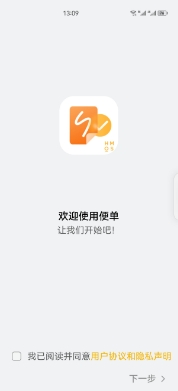

图4.1.1

`	`在此处，用户可点击高亮字体处的链接，打开用户协议和隐私政策的界面，进行详细的阅读（图4.1.2）。我们希望通过隐私政策告知用户如何处理其个人信息，并清晰地阐明了收集、存储、使用、共享和保护用户信息的方式，以及如何处理用户的请求和投诉等。以及通过用户协议规范用户行为，其中包含软件的使用限制、禁止的行为、用户义务和责任、维权条款等，以防止用户滥用软件、违反法律法规和侵犯他人权利。

图4.1.2

`	`在用户阅读完并确认后，可以在上一界面，在是否同意处勾选后，点击进入程序。
## **4.2 引导界面**
`	`在用户首次点击进入并通过用户协议和隐私政策后，会进入引导界面（图4.2.1）。引导界面作为软件使用过程中的一个重要组成部分，可以帮助用户快速了解软件的基本功能和操作方法，提高用户的使用效率和体验。在这里我们分别对修改，完成及添加待办事项；收起，展开及切日历，展开象限，快捷同步等功能进行了详细的操作方式的介绍，以帮助用户快速找到需要的功能，指引其完成操作，以提高软件使用效率和体验。

图4.2.1

以下为部分引导界面所进行教学的操作。

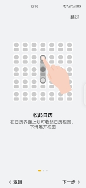  

图4.2.2                       图4.2.3                       图4.2.4

若用户在使用期间遗忘了引导界面介绍的操作方式，可以通过“设置-关于-打开引导界面”的路径，重新唤起以上的引导界面，熟悉对应操作（图4.2.5-图4.2.6）：

          ![图形用户界面, 应用程序

描述已自动生成]

图4.2.5                                    图4.2.6
## **4.3 清单界面**
`	`在首次进入程序，通过欢迎界面和引导界面后，以及之后进入程序，都会进入该清单界面。即在下方页签栏处显示为“清单”高亮的界面（平板横置时该页签在左侧）。同时，也可以通过该页签的点击，切换至“日历”、“四象限”或是“设置”界面。如图4.3.1：

图4.3.1

`	`在该清单界面左上方，有两个下拉选择按钮，上方的可以进行日期的选择，以查看对应日期的待办事项。

图4.3.2

`	`下方的可以进行待办单的选择，即选择查看选定日期下，对应待办单或是全部待办中的具体待办事项。

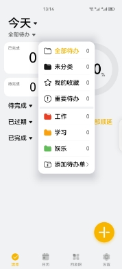

图4.3.3

在平板端UI界面中，下方的待办单选择下拉按钮移动到左边的选择栏中，如下：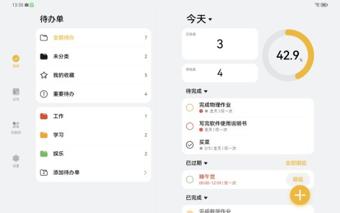

图4.3.4

`	`在下方是数据展示区域，其左边，通过数字的形式向用户显示在所选择的日子和选择的对应待办单下，已完成待办和未完成待办的数量。右边则是一个百分比显示环，能够直观的显示用户目前已完成的待办占全部待办的比例，以便帮助用户更好地安排时间，合理分配精力，提高完成任务的效率。同时我们希望当用户看到待办百分比逐渐增加时，会感到自己取得了进步，从而增加完成任务的动力。

图4.3.5

`	`再下方是我们具体显示在所选择的日子和选择的对应待办单下，对应的全部“待完成”、“已过期”和“已完成”的待办。这三者都可以通过点击其名称边上的三角形，以打开或折叠对应分类中的待办（图4.3.6~图4.3.7）。

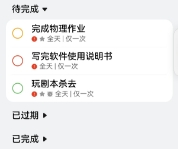          

图4.3.6                                    图4.3.7

`	`这三者中，“待完成”指的是，在用户设置的对应时间内，但还未完成或未达到全部完成次数的待办。

          

图4.3.8                                    图4.3.9

`	`这两者可以在待办第二行中看出区别，有“n/m”的是需要多次完成，且未全部完成的待办，否则是未完成的单次待办。

`	`在一条待办中，还有其他的信息，其中最左边的圈的颜色，对应了用户将该待办存放在哪个待办单中，即这个确认框的颜色和该待办所归类的待办单的颜色保持一致。

第二栏中的感叹号表示用户是否将其列为重要待办，若为重要代办，也会在四象限中对应展示；五角星对应的是该待办是否被用户放入“我的收藏”；闹钟图标对应的是用户是否为该待办设置了闹钟提醒。后面的“有效时间|循环规则”中，前面的表示该待办的有效时间，全天指全天有效，如果给的是某一时间段就是在这每一时间段有效。后面的次数则是代表该待办的重复方式，如“每天”就是每天出现，“每三天”就是每三天现需要完成一次。如图4.3.8。

`	`“已过期”则是指，在当天中，当前时间已经过了该待办对应的有效时间，故为已过期。其中已过期的待办可以顺延，点击右侧的顺延即可，若要全部顺延，则点击“已过期”右边的全部顺延即可，如图4.3.10：

图4.3.10

`	`“已完成”则是指已经完成了的待办，即完全完成（即多次的任务也全部完成）。其中，已完成的任务前面的勾是填充式的，且标题会有删除线，并在待办第二行中末尾会显示完成时间，如图4.3.11：

图4.3.11

此时长按前面的勾选部分，可以减少一次完成次数，使得该待办重新成为待完成状态。

如果是部分完成，前面的勾是线条式的，如图4.3.9：

`	`如果长按待办主体部分，可以呼出如下界面：

图4.3.12

`	`此时可以通过待办后方的复选框，选择对应待办，进行收藏，移动，删除，全选等操作。其中移动，删除点击后，对应界面如图：

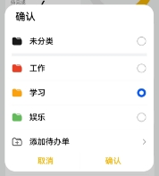        

图4.3.13                                   图4.3.14

`	`右下角的添加按钮，单击可以呼出添加待办的添加界面，若是打开了设备同步，可以长按添加按钮，一键向所有设备同步或是接收最新数据。

        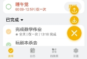

图4.3.15                                   图4.3.16

点击待办单的选择栏最后一行，可以进行待办分类的选择以及待办单添加的操作。

`	`若是添加待办单，则可以在跳出界面进行名字，颜色的选择，如图：

图4.3.17
## **4.4 添加界面**
`	`通过清单界面右下角的添加按钮单击进入，再未展开前界面如下，可以输入待办名称，选择放入的待办单，选择是否收藏，是否重要，并选择其生效时间。创建完成后点击保存即可。

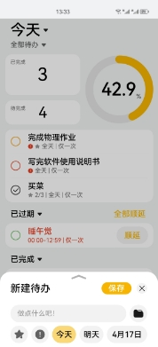

图4.4.1

`	`展开后的添加界面如下，可以添加备注，设置是否提醒以及对应提醒时间，设置重复规律，有效时间等。

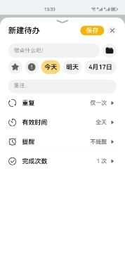

图4.4.2

## **4.5 日历界面**
`	`在页签中，点击日历即可切换到日历界面。默认的日历界面会显示当前月份中，每一天待办的缩略，并会给出完成待办比例的百分比环。

`	`在左上角，有两个下拉选择按钮，可以选择月份和待办单。选择后，下方日历会根据所选的情况显示对应的内容。同时在当前日历界面左右滑动可以切换月份。

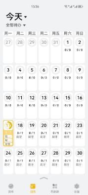

图4.5.1

`	`若是选择了某一天，或是点击了下方的上箭头，则会在下方显示对应日子对应待办单的全部待办情况，其显示规则与清单界面相同，故不再赘述。

图4.5.2

`	`其中上方的日历部分会保留当前周的预览，此时若左右滑动日历部分，则是切换上下周情况。
## **4.6 四象限界面**
`	`在页签中，点击四象限即可切换到四象限界面。

在四象限界面中，整个界面被分为四界面，分别是“重要且紧急”、“重要但不紧急”、“不重要但紧急”、“不重要且不紧急”。这里的重要是根据用户在设置待办中，是否选择了感叹号，即由用户手动勾选是否重要。而紧急，则是由软件自身根据算法，判断当前时间与用户设定的待办有效时间间隔来判断是否紧急。判断后，会在根据用户上方两个下拉选择栏选择的条目筛选后，将该分类中的待办，根据是否重要和是否紧急，分别显示在四象限中。

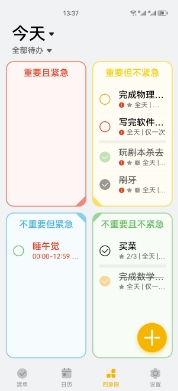

图4.6.1

`	`其中，可以根据前方判定框，了解该待办处于什么情况。空框为未完成，线条勾为完成部分，填充勾为全部完成。

`	`同时点击对应框的标题，可以打开该象限，观察对应待办的详细细节。打开后再次点击象限名可以收起该象限，如图4.6.2：

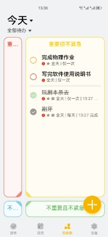

图4.6.2
## **4.7 设置界面**
在页签中，点击设置即可切换到设置界面。

![ref4]

图4.7.1

“本地备份”点击后可以打开对应界面，之后可以开启自动备份，即在每次退出应用时候自动备份。或者可以在下方点击立即备份以手动备份。同时可以点击右侧的刷新查看当前所有备份情况。

![ref5]

图4.7.2

`	`点击“多端同步”后打开界面如图4.7.3，开启后可以下载或者上传数据并储存在分布式数据库中。并且在下方可以查看已经连接的设备情况。

![ref6]

图4.7.3

`	`点击“编辑待办单”，可以对待办单进行编辑，进行删除，改名和更改颜色的操作，如图4.7.4。

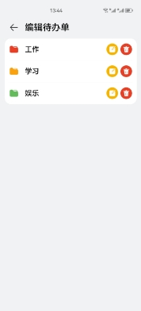

图4.7.4

`	`点击“主题色”，可以对软件主题色进行更改，更改后需要重启软件才能生效。

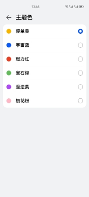

图4.7.5

`	`点击“默认重复时长”，可以更改默认重复时长，以便于用户在创建待办时，选择重复时长更加方便。

`	`点击“默认提醒时间”，可以更改默认提醒时间，以便于用户在创建待办时，设置提醒时间时更加快捷。

`	`点击“星期开始于”，可以根据用户习惯，更改由星期一开始或者星期日开始一周。

`	`点击“时间制式设置”，可以根据用户习惯，更改时间制式为12小时制或24小时制。

`	`点击“常见问题”，可以查看一些常见问题的解答并了解咨询方式。

图4.7.6

点击“用户协议与隐私声明”，可以查看本软件的用户协议与隐私声明。

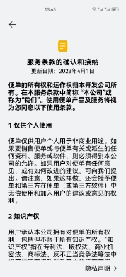

图4.7.7

点击“关于”，可以了解更多关于本软件的信息，如软件版本，官网网址，邮箱等。

![图形用户界面, 应用程序

描述已自动生成]

图4.7.8
# **五、结论**
`	`本文主要介绍了一个鸿蒙原生的，具有多端适配和同步备份功能的待办清单类应用，不仅可以让用户添加、编辑、删除、筛选、归档自己的任务，还可以让用户设置任务的优先级、截止日期、重复规则、提醒方式等多种属性，让用户更灵活地管理自己的任务。我们还提供了日历页面、四象限页面、多种万能卡片等方式拓展用户的使用场景，优化用户的使用体验。解决了市面上主流待办清单类APP要么功能过于复杂，要么功能过于简单，还有云端数据同步和安全性之间矛盾的问题。

`	`本应用的优势主要在于支持多设备，可以在不同的设备间（鸿蒙系统的手机、平板、折叠屏）交换和同步用户的数据，让用户可以随时随地地查看和更新自己的任务清单。这些功能全都是在本地进行的，不必担心数据泄露。同时因为是原生鸿蒙应用，我们的应用流畅稳定，占用空间小，设计也符合系统一致性。

`	`还需要改进的地方主要是本地备份暂未做加密优化，有隐私数据泄露风险。同时暂未完成对其他端设备的支持（比如手表），这主要是最低支持API版本为8造成的影响，期待后续软件的更新。

